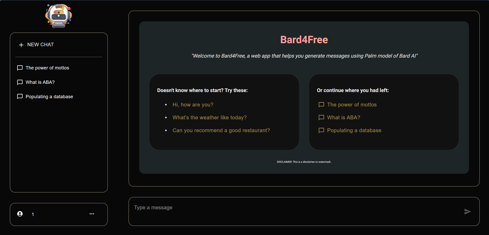

# BARD4FREE

> **NOTE:**
> Please note that Bard4Free is a educational project that is made possible solely by Google Bard. By using this repository, you agree to the [legal notice](./LEGAL_NOTICE.md). It's also worth mentioning that, since this project is powered using Bard API, this is not suitable for any commercial purposes, activities and other similar actions. Therefore, I strongly discourage using it for any other purposes other than education.

> **REFERENCES:** 
> Thanks [GPT4FREE](https://github.com/xtekky/gpt4free) for inspiring me with this project 

## INTRODUCTION


This is a Chatbot Web App using Django combined with NextJS where user can perform any activity likes **'Create new conversation, Continue older conversations or Get a head start with Recommended prompt'** with a cost of creating an account on the website. Everything in this Web App is free to use. Enjoy your stay! 

## GETTING STARTED
### Prerequisites:
- [Download and install Python](https://www.python.org/downloads/) (This project used Python version 3.11 when develop).

- [Download and install NodeJS](https://nodejs.org/en/download) (This project used NodeJS v20.4.0 when develop).

### Start up the project:

First, clone this project:
```
git clone https://github.com/AmayaKuro/Bard4Free.git
```
#### BE
1. Navigate to `BE` folder:
```
cd Bard4Free/BE
```

2. (Recommended) Create a Python virtual environment:
You can follow the [Python official documentation](https://docs.python.org/3/tutorial/venv.html) for virtual environments.
```
python3 -m venv venv
```

3. Activate the virtual environment:
    - On Windows:
    ```
    .\venv\Scripts\activate
    ```

4. Install the required Python packages from `requirements.txt`:

```
pip install -r requirements.txt
```

5. Go to `BE` folder that contain `manage.py` and start up the server:
```bash
# Find yourself the location of the folder
cd BE

# Start the server
python manage.py runserver
```

then you should be good to go :ok_hand:

> **NOTE:**
> This BE will take your local IP address at port 8000 (e.g. http://127.0.0.1:8000/), so if you want to test BE's API, you can link your testing app to that route.

#### FE
1. Navigate to `FE` folder:
```
cd Bard4Free/FE
```

2. Run FE NextJS app:
```bash
npm run dev
```

3. Go to `localhost:3000` and enjoy the product


#### CURRENT STATE OF THE PROJECT:
- `UNDER CONSTRUCTION`